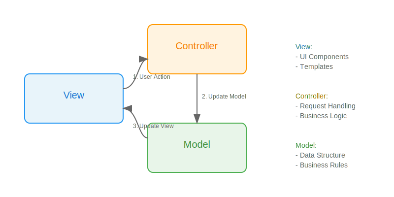
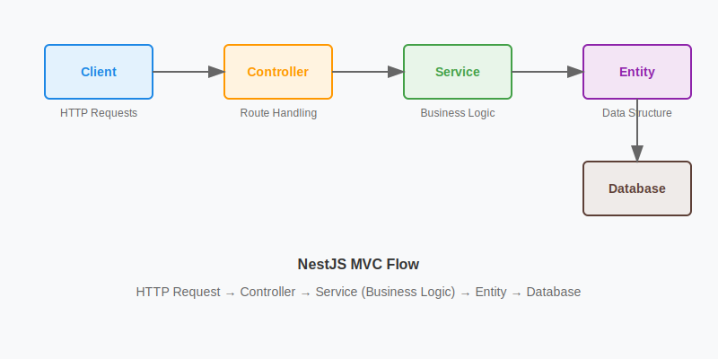

**TLDR:**

<div class="tldr">

**MVC (Model-View-Controller)** is an architectural pattern that divides application into 3 main components:

**Classical Approach:**

1. **Model** - manages data and business logic
2. **View** - displays user interface
3. **Controller** - mediates between Model and View

**Modern Framework Implementation (NestJS):**

1. **Model** is **split** into:

- **Entity** (data structure)
- **Service** (business logic)

2. **View** - View in modern applications is often a separate frontend (e.g., React) consuming API data, rather than being tightly integrated with the backend.
3. **Controller** - manages HTTP routing and requests

**Main Difference?**

- **In classic MVC**, the Model handled both data structure and business logic.

- **In modern frameworks**, this responsibility is split into two layers: Entity (defining data structure) and Service (handling business logic). This improves code organization and makes testing easier.

**Modern data flow:**

```js
1. Request:
View -> Controller -> Service -> Entity -> Database

2. Response:
Database -> Entity -> Service -> Controller -> View
```

Communication is bidirectional and always the same pairs of components communicate with each other:

```js
View <-> Controller <-> Service <-> Entity <-> Database
```

This evolution of MVC helps maintain separation of concerns while adapting to modern web development needs.

</div>

The **Model-View-Controller (MVC)** is **an architectural pattern** that divides an application into **three interconnected components**, creating:

1. clear separation of concerns
2. better code organization and maintainability.

#### Core Components (classical approach)



#### 1. Model

- Manages data and business logic
- Handles data validation
- Contains business rules
- Independent of the UI
- Manages application behavior
- Notifies observers about changes

#### 2. View

- Presents data to users
- Handles the visual representation
- Receives user input and displays updates
- Can be any output representation (web page, chart, diagram)

#### 3. Controller

- Acts as an interface between Model and View
- Processes user input and business logic
- Updates the Model and View accordingly
- Maintains program flow and data integrity

This architecture has become fundamental in modern web development, forming the basis for many frameworks and serving as a blueprint for scalable application design.

#### Modern Framework Implementation (NestJS)

In modern frameworks like NestJS, the classic MVC pattern has evolved to include additional layers:



##### Model vs Entity + Service Pattern

**Classic MVC Model:**

- Contains both data structure and business logic
- Handles validation and data processing
- Manages application behavior
- Is responsible for business rules

**In modern frameworks like NestJS, the Model is split into:**

- **Entity** - Represents the database schema and contains only data attributes.
- **Service** - Handles business logic, data validation, and communication with the database via the repository pattern.

This separation ensures better maintainability and testability. See the example below:

##### Benefits of MVC and Modern Implementation

- Loose coupling between components improves maintainability
- Clear separation of concerns (data vs. logic vs. presentation)
- Better testability (Services can be tested independently, Entities can be mocked)
- Modular architecture, making scaling and extension easier
- Encourages parallel development of features

This modern interpretation of MVC shows how architectural patterns can evolve to meet contemporary development needs while maintaining the core principles of separation of concerns and maintainable code.

#### NestJS example

**1. Entity**

```ts
@Entity()
class User {
  @PrimaryGeneratedColumn()
  id: number;

  @Column()
  name: string;
}
```

- Only represents data structure
- Defines database schema
- Contains entity attributes
- Doesn't contain business logic
- In NestJS, business logic moved to Services

**2. Service**

```js
@Injectable()
class UserService {
    constructor(@InjectRepository(User) private repo: Repository<User>) {}

    async findAll() {
        return this.repo.find();
    }

    async createUser(data: CreateUserDto) {
        // Data validation
        if (!this.isValidUserData(data)) {
            throw new Error('Invalid user data');
        }

        // Business logic
        const user = new User();
        user.name = data.name.trim();

        // Database operation
        return this.repo.save(user);
    }

    private isValidUserData(data: CreateUserDto): boolean {
        return data.name && data.name.length >= 3;
    }
}
```

- Contains business logic extracted from the Model
- Handles data validation and processing
- Manages database operations through Repository
- Implements application's core functionality
- Acts as a bridge between Controller and Entity

This is where the actual business logic lives:

- Validates incoming data
- Processes business rules
- Performs database operations
- Handles error cases
- Manages application state

The Service layer ensures that all business rules are centralized and reusable across different parts of the application while maintaining clean separation of concerns.

**3. Controller**

```js
@Controller('users')
class UserController {
    constructor(private userService: UserService) {}

    @Get()
    getUsers() {
        return this.userService.findAll();
    }

    @Post()
    createUser(@Body() userData: CreateUserDto) {
        return this.userService.create(userData);
    }
}
```

- Uses decorators (@Controller, @Get, @Post) to define routing
- Injects Service through constructor
- Passes requests to appropriate Service methods
- Returns responses to the client

This is a practical implementation of the Controller layer that:

- Receives HTTP requests
- Processes input data
- Delegates business logic to Service
- Returns appropriate responses

The Controller acts as a traffic manager, directing incoming requests to the right parts of your application while maintaining clean separation of concerns.

**4. View**

In a full-stack application, View would be represented by:

- Templates (if using server-side rendering)
- Frontend (e.g., React components) consuming the API

**Data flow in this code:**

1. HTTP request hits the Controller
2. Controller passes request to Service
3. Service works with Model
4. Result returns through Controller to client

## Sources

[1] _Claude 3.7 Sonnet_. (2024). _Comprehensive understanding of MVC architectural pattern and its modern implementations_.
